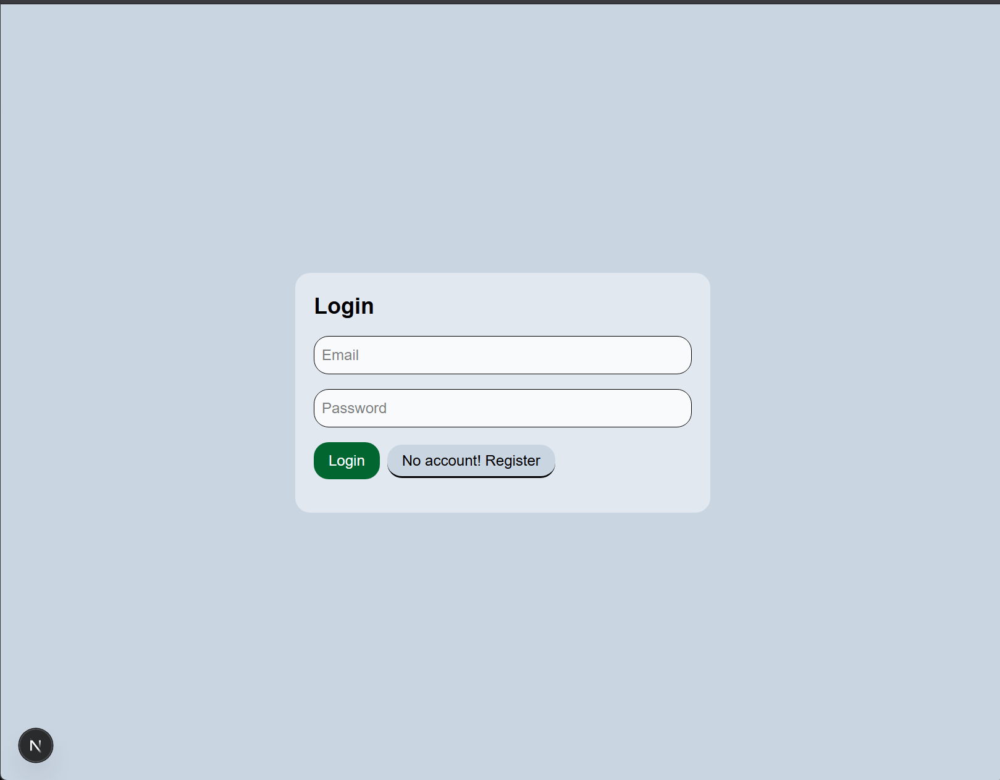
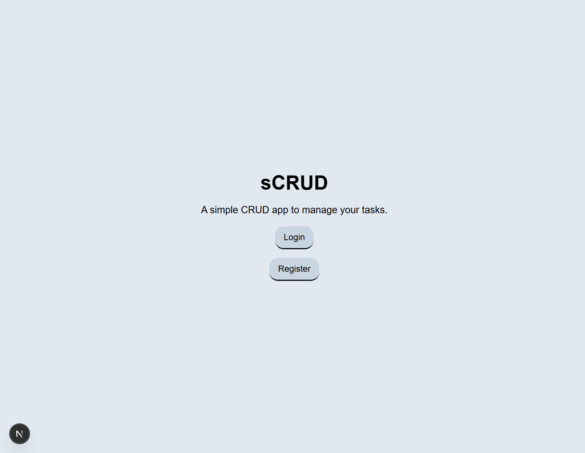
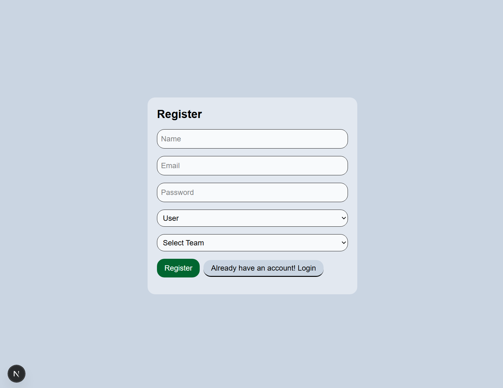
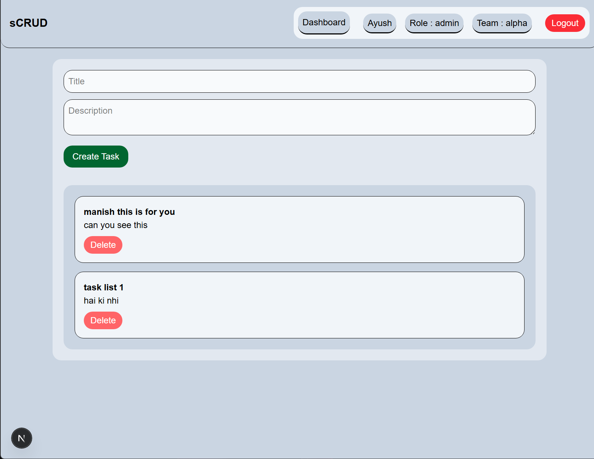

## sCRUD - a task management app

sCRUD is a task management app that allows users to create, read, update, and delete tasks. To get their own task from the team admin, although it can be scaled and be managed.
The application store multiple user and multiple role, doing the CRUD operations and team based tasks.

## Technology used

# Frontend
Next.js
JavaScript
React Router
Axios
Tailwind CSS

# Backend
Node.js
Express.js
JavaScript
MongoDB
Mongoose
Authentication
JWT
bcrypt
Redis(ioredis)

# Deployment

Vercel (Frontend)
Render (Backend)

# Tool
Git
Thunder-client

## Key Features

# Authentication and security

Jwt based authentication
protected api routes
team based task management
password hashing

# RBAC

admin:
Create Task
View Team Tasks
Delete Any Team Task
Update Any Team Task
View Team Members

user:
Create Task
View Team Tasks
Update Own Task
Delete Own Task

# Redis caching

storage of the data in a cache in between the mongoDB and the backend.

Redis caching is implemented and enabled when a Redis instance is available.

For deployments where Redis is not provisioned, the application gracefully falls back to direct database queries without affecting functionality.

# REST api architecture

maintains the proper api and https method to perfom the task and user management.

## Screenshots

# Login page

# Home page

# Register page

# Dashboard page

## Installation 

At first, fork this repository

# Backend Setup
run the command:

cd server
npm install
npm run start

# Frontend Setup

cd client
npm install
npm run dev

## Endpoints

# Authentication

POST /api/v1/auth/register
POST /api/v1/auth/login

# Tasks

GET /api/v1/tasks
GET /api/v1/tasks/:id
POST /api/v1/tasks
PUT /api/v1/tasks/:id
DELETE /api/v1/tasks/:id

## Scalability Considerations

The project is designed to be extensible and scalable:

API versioning (/api/v1)
Modular MVC architecture
Redis caching for reduced database load
JWT stateless authentication
Team-based data isolation
Easy migration to microservices
 Can integrate load balancers and distributed caching
MongoDB indexing can be added for faster queries

## Future Enhancements

if requred, we can go ahead with
Refresh Tokens
Email Verification
Forgot Password
Task Status Tracking
File Uploads
Notifications
Docker Deployment
Swagger Documentation# sCRUD
